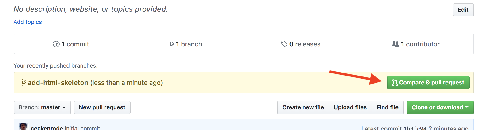
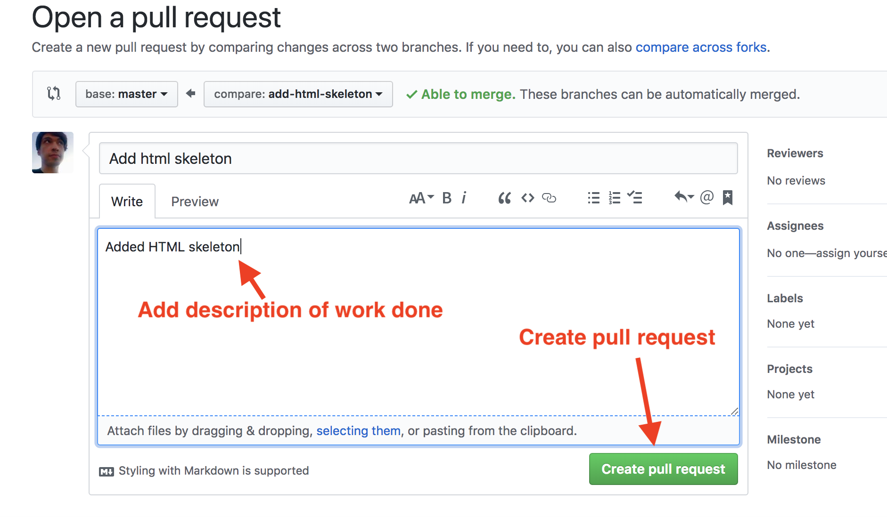
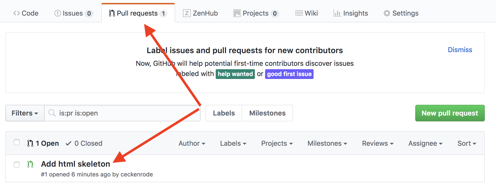
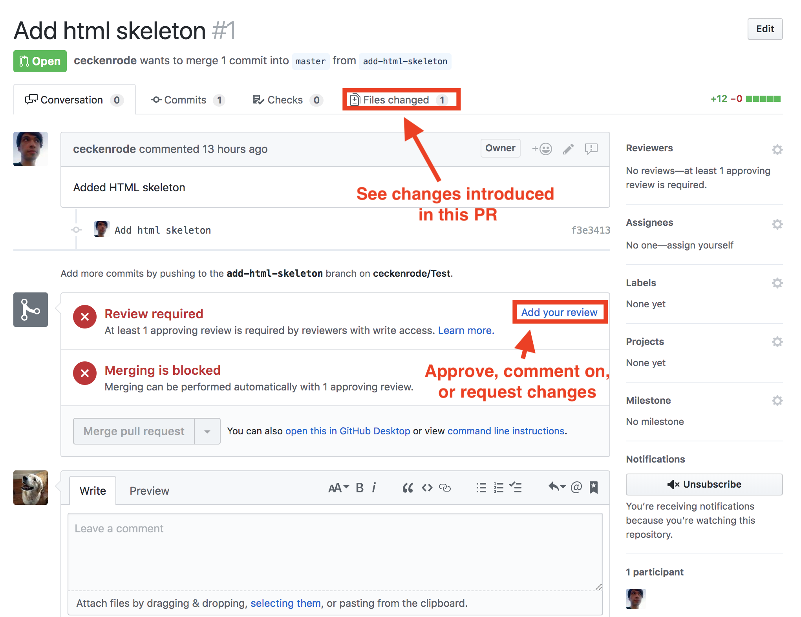
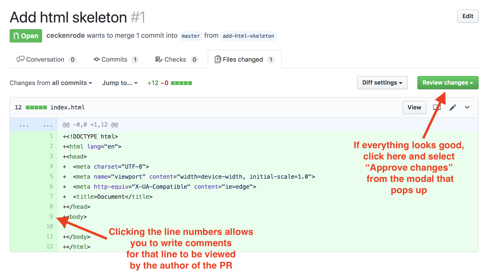
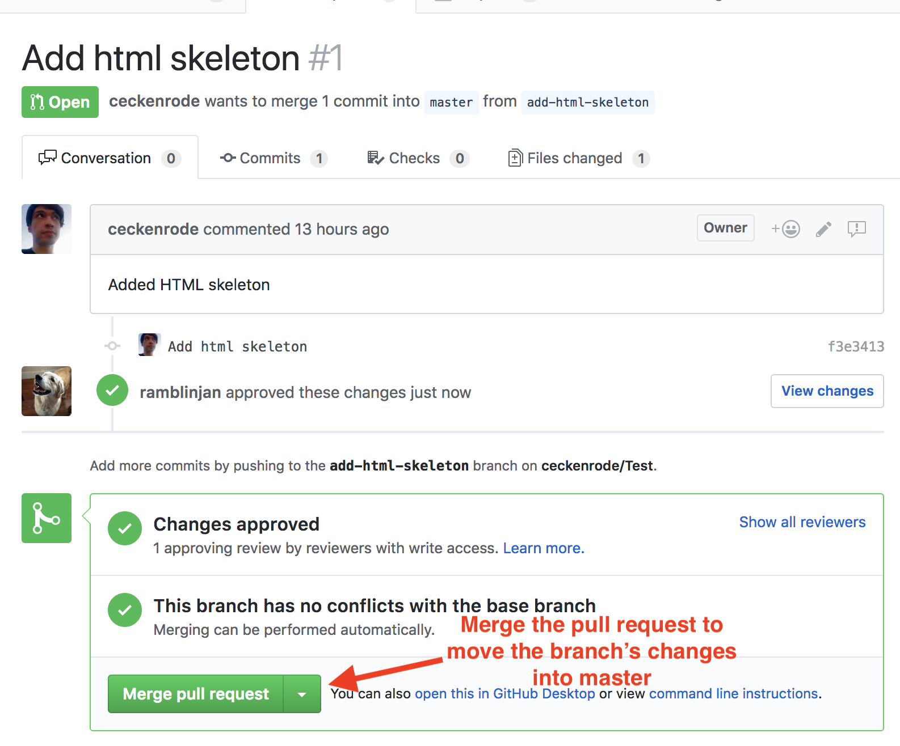

# Git Branching/Pushing

In this activity we will create a new branch, implement a feature, and then submit a pull request back into master. We will also cover reviewing pull requests and merging them into master.

# Instructions

## Part I: Branching and Submitting a Pull Request

* In this section we will create a branch, add a feature, and submit a pull request. **Only one group member should complete this section, everyone else should observe.**

* Clone the project repo onto your computer and cd into it.

* Run the following command in your terminal to create and checkout to a new branch:

  ```
  git checkout -b add-html-skeleton
  ```

* You should now be on a new branch named "add-html-skeleton". In order to verify this worked, run the following command in your terminal:

  ```
  git branch
  ```

* You should see two branches listed: `master` and `add-html-skeleton`. The `add-html-skeleton` branch should have an asterisk to the left of it. This indicates that this is the branch you're currently on.

* At the root of the repo, create a new file named `index.html`. Inside this file, add code for a basic HTML skeleton and save.

* In your terminal, add and commit the changes. Then push up your code by running following in your terminal:

  ```
  git push origin add-html-skeleton
  ```

* This should push up your code to to GitHub on a branch with the same name (`add-html-skeleton`).

* Go to the main repo page at github.com and you should see the following:

  

* Click "Compare & pull request".

* On the next screen, add a description of the work that was done and click the "Pull Request" button.

  

* If completed successfully, you should see the pull request listed under the repo's "Pull request" tab.

  

## Part II: Reviewing a Pull Request

* In this section we will review the pull request from Part I and merge it into master. **A different project member should complete this section while others observe**.

* Clone the repo to your computer if you haven't already done so and cd into it.

* First you will want to test the changes introduced by the `add-html-skeleton` branch locally.In order to examine the new branch on your local machine, run the following commands in your terminal:

  ```
  git fetch
  ```

  ```
  git checkout -b add-html-skeleton origin/add-html-skeleton
  ```

* This code should bring the copy of the `add-html-skeleton` branch that's on GitHub onto your computer. 

  * Make sure this worked by verifying that there's an `index.html` file in your local repo.

  * Normally you'd run the code here to make sure everything works properly.

* Check back out to your local `master` branch by running the following in your terminal:

  ```
  git checkout master
  ```

* Now go to your GitHub repo's main page and go to the "Pull request" section. Select the `add-html-skeleton` pull request from the list.

  

* At the next page select the option to see the "Files changed".

  

* You should be presented with all of the files that were changed in this PR.

  

* If there are any changes you would like made, you can click the line number to leave a comment the PR author will see and should address before approval. Otherwise click "Review changes" and approve the PR. You should be taken to the following screen:

  

* Click the "Merge pull request" button to add the branch's changes into master. Once complete you can delete the feature branch from your machine by running the following in your terminal:

  ```
  git branch -D add-html-skeleton
  ```

* Remember to use `git pull` on your master branch to update it.

### Hints

* Ask an instructor or TA if you get stuck or have any questions!
